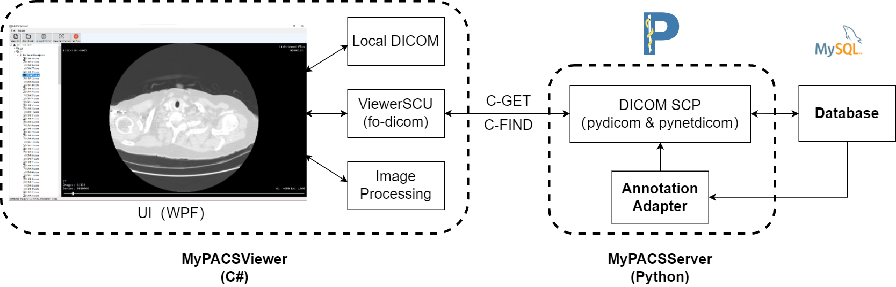

# MyPACS

## Prerequisites

- C\#前端
  - WPF
  - [fo-dicom 4](https://fo-dicom.github.io/dev/v4/)
- Python后端
  - Python 3.9
  - [requirements.txt](./MyPACSServer/requirements.txt)
- Database
  - MySQL 8.0

## Overview

- 一个自己实现的完整的基于DICOM协议的PACS系统。
- 实现功能：
  - 将产生的DICOM文件存储到远端Server并将其序列索引写入数据库。
  - 打开本地DICOM文件和文件夹并显示DICOM序列。
  - DICOM传输，从远端Server通过DICOM Q-R获取DICOM图像。
  - 对DICOM图像进行一些简单的图像处理（在前端处理）和进行图像分割（向后端请求）。
  

### Structure

- [StudySCU](./studySCU)：一个DICOM C-STORE SCU，用于模拟产生图像的检查设备端。
- [MyPACSViewer](./MyPACSViewer)：一个集成了ViewerSCU（一个DICOM Q-R SCU）的前端UI界面，模拟的是客户端。
- [MyPACSServer](./MyPACSServer)：一个DICOM Q-R/C-STORE SCP，并连接了一个本地用于存储DICOM数据索引信息和文件路径的MySQL数据库和一个Detection模块，模拟一个DICOM服务器工作站。在本次课程设计中，Database和Detection部分部署在远端服务器上，使用ssh连接。
- [Detection](./MyPACSServer/detection)：一个使用LIDC-IDRI数据集的肺结节检测模块。

### Workflow

1. StudySCU将DICOM图片使用C-STORE传输到MyPACSServer，并将其索引信息和文件路径写入数据库。
2. 用户在使用MyPACSViewer时，可以打开本地文件浏览，也可以通过DICOM Q-R机制，从MyPACSServer获取DICOM文件。
3. 用户可以对图像进行简单的处理，这一部分的处理在MyPACSViewer内部进行。
4. 对于较复杂的图像处理（如图像分割），通过在C-GET Request中插入特定的Tag信息，使MyPACSServer返回相应的处理结果。

## Submodules

### [StudySCU](./StudySCU)

- 一个基于C\#命令行应用的DICOM C-STORE SCU
- DICOM协议使用fo-dicom库。

### [MyPACSViewer](./MyPACSViewer)

- 一个基于C\#语言WPF（Windows Presentation Foundation）开发的DICOM Viewer。

- DICOM协议使用fo-dicom库。

  

- 使用MVVM设计模式（Model-View-ViewModel）

  

### [MyPACSServer](./MyPACSServer)

- 一个基于Python 3.9开发的DICOM Server，使用json配置文件，示例见[default.json](./MyPACSServer/default.json)。
- DICOM协议使用pydicom和pynetdicom库。
- 数据库使用MySQL，并使用pymysql和records库进行连接和处理。
- 使用Python内置的logging模块在控制台输出日志并写入文件。

### [Detection](./MyPACSServer/detection)

- 使用LIDC-IDRI数据集进行肺结节检测

