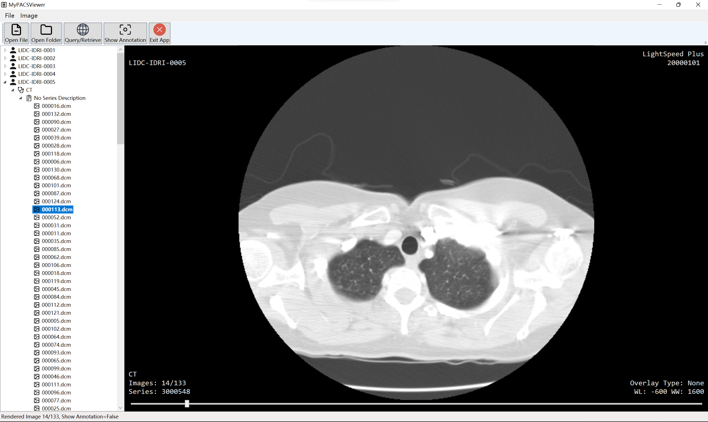

# MyPACS

## Prerequisites

- C\#前端
  - WPF
  - MVVMLight
  - [fo-dicom 5](https://github.com/fo-dicom/fo-dicom)
- Python后端
  - Python 3.10
  - [requirements.txt](./MyPACSServer/requirements.txt)
- Database
  - MySQL 8.0

## Overview

- 一个自己实现的完整的基于DICOM协议的PACS系统。
- 实现功能：
  - 将产生的DICOM文件存储到远端Server并将其序列索引写入数据库。
  - 打开本地DICOM文件和文件夹并显示DICOM序列。
  - DICOM传输，从远端Server通过DICOM Q-R获取DICOM图像。
  - 对DICOM图像进行一些简单的图像处理（在前端处理）和数据标注的可视化（从后端拉取结果）。

### Structure

- [MyPACSViewer](./MyPACSViewer)：一个集成了ViewerSCU（一个DICOM Q-R SCU）的前端UI界面，模拟的是客户端。
- [MyPACSServer](./MyPACSServer)：一个DICOM Q-R/C-STORE SCP，并连接了一个本地用于存储DICOM数据索引信息和文件路径的MySQL数据库和一个adapter模块，模拟一个DICOM服务器工作站。
- [Adapter](./MyPACSServer/adapter)：一个数据标注可视化的适配器（可扩展自定义，在本项目中使用LIDC-IDRI数据集标注作为示例）。

### Workflow

1. 在MyPACSServer端，将DICOM数据的索引信息和文件路径写入数据库。
2. 用户在使用MyPACSViewer时，可以打开本地文件浏览，也可以通过DICOM Q-R机制，从MyPACSServer获取DICOM文件。
3. 用户可以对图像进行简单的处理，这一部分的处理在MyPACSViewer内部进行。
4. 用户在自定义Adapter后，通过在C-GET Request中插入特定的Tag信息，可以使MyPACSServer返回相应的带标注的处理结果返回前端进行可视化。

## Submodules

### [MyPACSViewer](./MyPACSViewer)

- 一个基于WPF开发的DICOM Viewer,使用MVVM设计模式（Model-View-ViewModel）。
- DICOM协议使用fo-dicom库。

  

### [MyPACSServer](./MyPACSServer)

- 一个基于Python 3.9开发的DICOM Server，使用json配置文件，示例见[default.json](./MyPACSServer/default.json)。
- DICOM协议使用[pydicom](https://github.com/pydicom/pydicom)和[pynetdicom](https://github.com/pydicom/pynetdicom)库。
- 数据库可以自行配置。使用[records](https://github.com/kennethreitz/records)库进行连接和处理。在本项目中使用MySQL作为示例。
- 使用Python内置的logging模块在控制台输出日志并写入文件。

### [Adapter](./MyPACSServer/adapter)

- 一个标注可视化的适配模块，如需自定义则必须继承[AdapterBase](./MyPACSServer/adapter/adapter_base.py)类并在配置文件中注册

